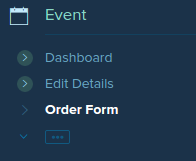
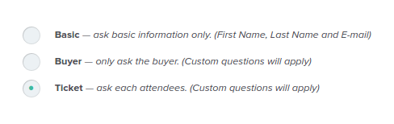

**Question:** For people buying tickets in bulk, is it possible to capture the details of all attendees he/she is buying for?
{:.question-box}

Yes, this is possible. However, keep in mind that the buyer will be responsible for entering the details of the other attendees, if they are buying tickets for others. To activate this feature:

* In the event dashboard, click on “Order Form”. 
  

* Choose “Ticket” option to ask each attendee all the questions required. 
  
