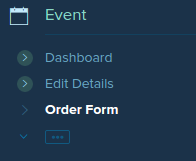
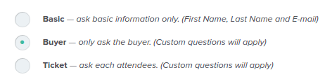

### Types of Information

At Ticketbase, it is important to learn that there are three types of information that can be collected:

   * __Basic__ (default) - where basic information (first name, last name and email) are asked. [Custom questions] do not apply in this classification, though.

   * __Buyer__ - where, regardless of how many tickets are bought, any information about the buyer may be asked. [Custom questions] apply.

   * __Ticket__ - where each attendee, all the tickets are intended for, shall be asked for information. [Custom questions] apply.

### Choosing the Information Type

When you've decided on the information you need from the ticket buyers and/or attendees, you may now choose the type:

   * Go to "Order Form"
     

   * Choose the type of information you've decided to collect
     

   * Mark all the information you’d want to collect under “Available Fields”

   * Click Save.

[Custom questions]:creation-of-custom-questions.html
