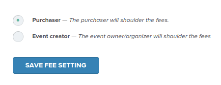

Unlike other ticketing platforms, Ticketbase charges a small, flat fee per ticket, regardless of the amount of the ticket. Ticketbase fee depends on the [currency] used for the event:

| Currency          | Fees                   |
| ---               | ---                    |
| US Dollar         | $0.99 per ticket       |
| Canadian Dollar   | $0.99 per ticket       |
| British Pound     | £0.65 per ticket       |
| Japanese Yen      | ¥120.00 per ticket     |
| Euro              | €0.75 per ticket       |
| Australian Dollar | $1.15 per ticket       |
| Singapore Dollar  | $0.99 per ticket       |
| Philippine Peso   | ₱45.00 per ticket      |
| Indonesian Rupiah | Rp14,000.00 per ticket |
| Swedish Krona     | kr7.50 per ticket      |
| Israeli Shekel    | ₪3.90 per ticket       |
| Thai Baht         | ฿32.50 per ticket      |
| Mexican Peso      | $15.00 per ticket      |
| New Taiwan Dollar | NT$30.00 per ticket    |
| Hong Kong Dollar  | $7.50 per ticket       |

As soon as the transaction takes place, Ticketbase already takes the flat fee, and transfers the payment to the organizer's [account].

Ticketbase does not charge anything else apart from the small, flat fee per ticket.

The organizer may opt to absorb the ticket fees or let the customers shoulder them.

### Absorbing or passing the ticket fees

* Click “Tickets” on the left column of the [event dashboard].

  

* Then on the main dashboard, under “Fees (beta)”, choose “Event creator”, to absorb the ticket fees, or "Purchaser" for the customers to shoulder the ticket fees.

  

* Then click “Save Fee Setting”

[currency]:supported-currencies.html
[account]:payment-gateways.html
[event dashboard]:event-dashboard.html
