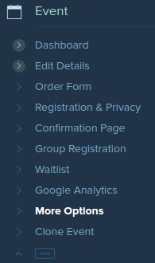
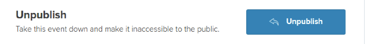

To make your event inaccessible for the meantime, you may unpublish your event, and [publish] it again on a later date.

Purchased tickets from previously published events shall remain valid, and registered to the event, unless otherwise the organizer has [cancelled] the event, and has [informed] and/or [refunded] the ticket buyers.

### To unpublish events

* On the left column of your main dashboard, click on “More Options” 
  

* On the “More Options” dashboard, click on the “Unpublish” button to unpublish the event. 
  

[publish]:publishing-events.html
[informed]:updating-customers.html
[refunded]:refunding-customers.html
[cancelled]:cancelling-events.html
